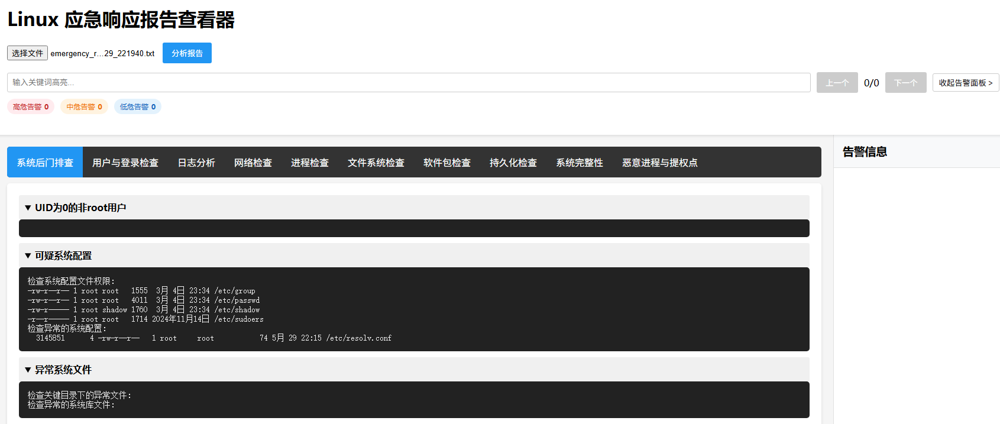

# Linux应急响应工具集

## 项目简介
这是一个用于Linux系统安全应急响应的工具集，包含一键式信息收集脚本和可视化报告查看器。该工具集能够快速收集系统安全相关信息，并通过基于规则的分析引擎对收集到的信息进行安全风险评估。

## 截图：


## 功能特性

### 1. 信息收集脚本 (emergency_response.sh)
- **系统后门排查**
  - UID为0的非root用户检测
  - 可疑系统配置检查
  - 异常系统文件检测
  
- **用户与登录检查**
  - 当前用户信息
  - 所有用户列表
  - 最近登录记录
  - 登录失败记录

- **日志分析**
  - 系统日志错误
  - 安全日志错误

- **网络检查**
  - 监听端口
  - 活动连接
  - 网络配置
  - 路由表
  - 可疑连接

- **进程检查**
  - 高CPU占用进程
  - 可疑脚本进程

- **文件系统检查**
  - SUID文件
  - 最近修改的文件

- **软件包检查**
  - 已安装软件包列表

- **持久化检查**
  - 自启动服务
  - 计划任务
  - SSH公钥
  - 启动项配置

- **系统完整性**
  - 关键二进制文件校验
  - 系统文件完整性

- **恶意进程与提权点**
  - 可疑进程
  - 可疑提权点
  - 隐藏文件

### 2. 报告查看器 (emergency_report_viewer.html)
- 分类展示收集的信息
- 实时搜索功能
- 告警信息分级展示（高、中、低）
- 告警定位与跳转
- 支持文本和JSON格式报告

### 3. 规则引擎
基于YAML的规则配置系统，包含多个规则集：
- 后门检测规则
- 网络异常规则
- 持久化检测规则
- 进程异常规则
- 系统异常规则
- 日志分析规则
- 文件系统规则

## 使用方法

### 1. 信息收集
```bash
# 以root权限运行脚本
sudo bash emergency_response.sh
```
脚本会在当前目录生成格式如 `emergency_report_YYYYMMDD_HHMMSS.txt` 的报告文件。

### 2. 查看报告
1. 打开 `emergency_report_viewer.html`
2. 点击"选择文件"按钮，选择生成的报告文件
3. 点击"分析报告"按钮开始分析
4. 使用界面功能查看详细信息：
   - 使用搜索功能查找特定内容
   - 查看右侧告警面板的分析结果
   - 点击告警可跳转到对应位置

## 系统要求
- 操作系统：支持主流Linux发行版（Ubuntu、Debian、CentOS等）
- 权限要求：需要root权限
- 浏览器要求：支持现代浏览器（Chrome、Firefox、Edge等）

## 注意事项
1. 脚本需要root权限才能收集完整信息
2. 部分命令在不同发行版中可能不可用，脚本会自动跳过
3. 报告查看器需要现代浏览器支持
4. 建议定期更新规则库以适应新的安全威胁

## 规则定制
规则文件位于 `rules` 目录下，采用YAML格式：
```yaml
- id: rule_id
  description: 规则描述
  level: [critical|high|medium|low]
  target_section: 目标检测区域
  pattern: 正则表达式模式
  case_sensitive: true/false
```

## 贡献
欢迎提交Issue和Pull Request来帮助改进这个项目。

## 许可证
[待补充]

## 免责声明
本工具仅用于安全应急响应和系统检查，请勿用于非授权的安全测试。使用本工具进行的任何操作均由使用者承担全部责任。
